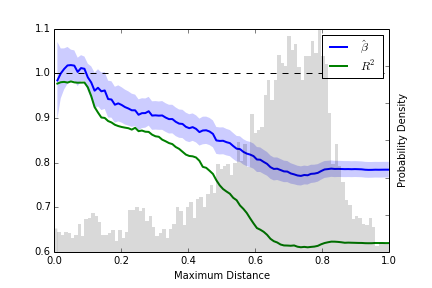
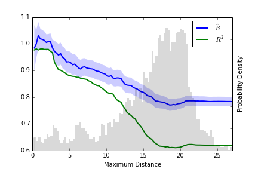

## Introduction ##
This is an analysis of the amount of copy number information available to us
from 16S sequence.

Basically, I'm going to try to asses how well our database informs us of
the copy number of a random sequence.

## How to use this README ##
I don't guarantee that `*.ipynb` files will execute.
I DO 'guarentee' that `Makefile`s will execute.

## Notebook ##
### 2014-08-29 ###
I received `rrnDBv1_16S_byron_2014-08-29.fasta` and
`rrnDBv1_16S_byron_2014-08-29.meta` from Steve Stoddard.

```bash
cat seq/16S.fn | grep '^>' | sort | uniq -d
# Returns Nothing
cat seq/16S.fn | grep '^>' -c
# Returns '10056'
# There are this many sequences.
```

On the MSU HPCC (because
(`sina`)[http://www.arb-silva.de/aligner/sina-download/] doesn't run on OSX),
I downloaded `sina` and the aligned reference NR.

```bash
mkdir scratch; cd scratch
curl -O http://www.arb-silva.de/fileadmin/silva_databases/SINA/1.2.11/sina-1.2.11_centos5_amd64.tgz
# Downloads 3.417k
tar -xzf sina-1.2.11_cenos5_amd64.tgz
ln -s sina-1.2.11/sina sina
curl -O http://www.arb-silva.de/fileadmin/silva_databases/release_119/Exports/SILVA_119_SSURef_Nr99_tax_silva_full_align_trunc.fasta.gz
# Downloads 1061M
gunzip SILVA_119_SSURef_Nr99_tax_silva_full_align_trunc.fasta.gz
# Takes a little while to run.  It's 26GB...!
# I don't even think I can run this next command:
cat SILVA_119_SSURef_Nr99_tax_silva_full_align_trunc.fasta | grep '^>' -c
# Yep, it's taking forever.
# Output: 534968  Finally.  Half a million sequences!
sina -i SILVA_119_SSURef_Nr99_tax_silva_full_align_trunc.fasta -o 16S_ref.arb
```

This was going to take numerous hours to run.  Turns out there's a much
simpler way.

```bash
curl -o 16S_ref.arb http://www.<arb-silva.de/fileadmin/silva_databases/release_119/ARB_files/SSURef_NR99_119_SILVA_14_07_14_opt.arb
# This is the pre-built ARB database for sina
# Now I can align with just:
sina -i 16S.fn --intype=FASTA -o 16S.afn --outtype=FASTA --ptdb 16S_ref.arb
```

Alignment is now the time limiting step.
Instead of parallelizing myself, I'm going to use the ad-hoc parallelization
built in to `sina`.

```bash
# Reformat the sequences as ARB
sina -i 16S.afn --intype=FASTA -o 16S.arb --prealigned
# Do an offset/skip run on the ARB file.
for i in $(seq 1 10); do
    sina -i 16S.arb -o 16S.f$i.afn --ptdb 16S_ref.arb
    --select-step=10 --select-skip=$i
# This takes more like 20 minutes, and I just have to concatenate my
# output files in the end.
```

...Except not.  This method just gives me multiple files with the same thing.
I guess I am going to do the parallelization myself.


### 2014-08-30 ###
I finally got my sequence splitter working.
I split up all of the rrnDB sequences into 16 files,

```bash
bin/split_seqs.py< -n 16 seq/16S.fn seq/splits/16S.split%02d.fn
```

`scp`ed them to MSU's hpcc and ran `sina` on all of them.

```bash
for file in 16S<.split*.fn; do
    sina -i $file --intype=FASTA -o ${file/.fn/.afn} --outtype=FASTA \
            --ptdb 16S_ref.arb
cat 16S.split*.afn > 16S.afn
```

This took less than an hour, if I remember correctly.

I then concatenated the resulting alignments, and ran FastTree

```bash
fasttree -nt 16S.afn > 16S.afn.tre
```

locally (OSX) to estimate a phylogeny.  This took approximately
9 hours.  I think it would have been much faster if I had ungapped the
alignment first.
I'm not sure if this will actually do anything for the full alignment,
because *some* organism's sequence must be filling those positions, and I'm
using the full RefSeq database through KEGG.


### 2014-08-31 ###
I'm going to try and rename the ID's in 16S.afn.tre to something that's
easier to interpret.

```bash
cat 16S.tsv | awk '{print $1 "\t" $2 "_" $1}' > 16S.id_map.tsv
```

I've written `bin/rename_tree.py` to import the tree (`Bio.Phylo`),
rename each leaf, and then export the tree.
But now I'm finding that `Bio.Phylo` doesn't read the output of FastTree
correctly; leaf names are read as 'confidence' fields.

I'm not sure if the problem lies with FastTree, `Bio.Phylo`, or me.
While I can fix it, I don't like the idea of `bin/rename_tree.py` assuming
that newick trees are in a different format than `Bio.Phylo` does.

```bash
bin/rename_tree.py seq/16S.afn.tre meta/16S.id_map.tsv \
    > seq/16S.afn.rename.tre
```

I then explored this phylogeny in an ipython notebook
(`tree_exploration.ipynb`) and output some data.
Specifically, `tre/distances.txt` is a file with one row per genomeid.
Each row is composed of the genomeid, a tab, and then a comma separated list of
all of the pairwise distances between the sequences which were placed on that
tree from that genome.

From 10056 sequences on the tree, there were 2602 unique genomeids, and
1260 genomes had 16S features with divergent sequences.
Of these, the average distance was 0.033, and the mean per-genome maximum
distance was 0.032.
The fact that the latter is smaller is strong evidence that large distances
tend to be found under the same genomeid (which makes sense, since we're
talking about 'all pairwise distances').

I've written an ungapper for aligned sequences, so as to reduce the time
it takes to estimate the phylogeny.

```bash
bin/remove_gaps.py seq/16S.afn > seq/16S.ungap.afn
```

It takes about 20 minutes just to identify the gaps, with this many sequences,
and another 15 to remove them.
This could be easily parallelized, or maybe better vectorized.
But altogether, tree creation was MUCH faster!  Only 15 minutes.

I'm trying to figure out how to compare these trees.
They're *not* identical; I can tell from merely visual inspection.
With a little research, I find that the Robinson-Foulds distance
is a standard.
Downloading the Python package `DendroPy`, I find that there's a
branch length weighted version.
I rescale both my original and my ungapped tree, and then
calculate the RF-distance, which turns out to be 5% of each trees
branch length.
I'm not entirely sure, but I think this might mean that they're only
2.5% 'different' by some definition of difference.
In Python:

```python
import dendropy

a = dendropy.Tree.get_from_path('seq/16S.afn.tre', 'newick')
b = dendropy.Tree.get_from_path('tre/16S.ungap.afn.tre', 'newick')
a.scale_edges(1 / a.length())  # Scale to total length of 1
b.scale_edges(1 / b.length())  # Ditto
a.robinson_foulds_distance(b)
# Returns 0.0507...
```

Not entirely sure what to say about this.

Why are the two trees different?  My guess is that `fasttree` is not
throwing out gap positions, and therefore sequences come off as more similar
than they really are.
By removing gaps we remove this non-information.
I'm not sure if this really explains the different topologies, or what.
Comparing this '5%' figure to another source of error, when I compare my
ungapped tree to a tree built from my ungapped data, but using the
gapped tree as a starting place, and the `-fastest` option in `fasttree`:

```bash
fasttree -nt -fastest -intree seq/16S.afn.tre seq/16S.ungap.afn \
    > tre/16S.ungap.afn.fastest.tre
```

I get a normalized difference between this tree and my gapped tree of 0.0335.
Maybe we can call these "length-weighted Robinson-Foulds distance" or
something.

#### Correlation in rrn count across the phylogeny ####
Here I intend to look at the correlation between rrn copy number
of nearby leaves in the phylogeny.

I will do this first by walking through a list of leaves and finding the
copy number of the closest neighbor that is *not* from the same genome.

Let's get started:

```bash
bin/rename_tree.py tre/16S.ungap.afn.tre meta/16S.id_map.tsv \
    > tre/16S.ungap.afn.rename.tre
```


### 2014-09-01 ###
Today I made a figure showing the change in the \(R^2\) (in a regression
of copy number against mate's copy number in a random set of leaf pairs)
over a range of cutoff distances between pairs.



More descriptively, random branch-tip pairs were sampled from the tree.
~~These pairs, with some low probability, may have included features from the
same genome.~~
Pairs from the same genome were removed from downstream analysis.
The distances between pairs on the tree were then measured, and copy numbers
associated with each's genome were recorded.
The copy number of the first of the pair was then regressed against
the copy number of the second, producing a regression coefficient (with
confidence bounds), and the \(R^2\).
This regression was repeated after having cut the pairs to be less than a
given distance.
The \(R^2\) and estimator/ci were plotted against this maximum distance.
Overlayed (right Y-axis) is a normalized histogram of mate-pairs.


### 2014-09-02 ###
I remade the figure from yesterday, but this time rescaled by the distance
between 2831_3169705 (Escherichia coli str. K-12 substr. MG1655),
and 622_7088178
(Salmonella enterica subsp. enterica serovar Typhimurium str. D23580).



I think these represent two commonly understood strains, which are known
to be closely related.
They also diverged 100-160 Ma according to Meysman et al. (2013).
That article says:

> Current estimates put the divergence of the E. coli and S. Typhimurium
> strains approximately 100–160 Ma, which is about the same time frame as the
> divergence of the placental mammals (Kumar and Hedges 1998).

E. coli and Salmonella also both have 7 rrn operons.

After lab meeting, I redid the analysis with percent identity, instead of
branch length as a measure of evolutionary distance/nearness.
This works very similarly.

I've also realized that \(R^2\) is not really the best metric for our ability to
predict.  Really I should be using MSE, or something like that.
As a third adjustment, I'm now using a moving window, instead of a cutoff,
since there's no reason to overestimate our accuracy at high distances
by including a bunch of sequences from a lower distance.

I'm still getting regression slopes that are significantly different from
zero, which suggests that I am not getting an unbiased estimate of copy
number at higher distances between sequences.

### 2014-09-03 ###
I've redone the analysis, this time with 1e5 pairs, instead of 1e4.
During this process I've realized that copy number is bounded at 1,
so a linear regression is not a very good method.  The Pearson's correlation
coefficient (\(r\)) is still somewhat resonable, but not entirely.
Maybe I should be looking into various logistic regressions...?

I've saved the 1e5 data to the `res/` directory, so that I don't need to
regenerate all of it while I'm doing analysis.
I really _should_ save a script to regenerate all of it.
Maybe include a random seed, too, so that I get the same dataset every time.

#### Removing outliers ####
I've talked a bit with Steve about outlier sequences, whether because of the
way they show up in the database or because of where they occur in the tree
(_very_ long branches).
Taking a quick look at which genomes are represented in the 'outlier' group
on my tree, I find that several of them are from the same genomes.
This would normally suggest to me that it's not just a one-off annotation
error.
It is worth remembering, however, that each genome is being annotated by a
single group, so annotation errors are not independent.

This explanation appears to be correct.
When I align just these sequences using SILVA, and get taxonomic identification
as well, the outlier sequences not only lack identitity with anything in the
database, but also the algorithm can't even figure out which way to
orient the sequence.
So these probably aren't real 16S.
This is further confirmed by a `BLAST` search, which hits a lot of other stuff
(not 16S), and not just the original sequence.

Since these sequences have the potential to mess with my analysis, I've
removed them from my aligned sequences:

    from Bio.Phylo import read as read_tree

    tree = read_tree('tre/16S.ungap.afn.rename.tre', 'newick')
    outlier_clade = tree.common_ancestor('1572_992299', '1419_22388')
    # Two sequences that I found, via visual inspection to be
    # as disparate as possible within the outlier clade.

    fids = []
    gids = []
    for leaf in outlier_clade.get_terminals():
        gid, fid = leaf.name.split('_')
        gids.append(gid)
        fids.append(fid)

    all_inliers = []
    fid_set = set(fids)
    for rec in parse_seqs("seq/16S.ungap.afn", 'fasta'):
        if rec.name not in fid_set:
            all_inliers.append(rec)
    write_seqs(all_inliers, "seq/16S.ungap.no-out.afn", 'fasta')

I then ran fasttree again, in order to examine the effect on the phylogeny.

    fasttree -nt seq/16S.ungap.no-out.afn >tre/16S.ungap.no-out.afn

This phylogeny looks a ton better.


## TODOs ##
- TODO: Collect the relationship between copy number
        and the copy number of the closest not-same-genome 16S leaf on the
        tree.
- TODO: Further analysis of tree accuracy.
- TODO: Consider looking at Bayesian priors for phylogeny, in order
        to account for our uncertainty in the phylogeny.
- TODO: Look at the 
- TODO: Fix everything up so that Makefiles and IPython Notebooks execute.
- TODO: Compare the Robinson-Foulds distance of the original tree, made with
        outliers but where outliers have been removed, to the tree remade
        without outliers in the alignment.
